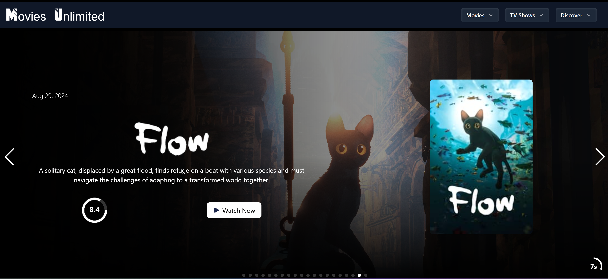

# Movies Unlimited 
  

          
  
  ## Description  ✏️
  
  A place to track and watch upcoming and favorite movie & tv shows.

  This appication is in-progress.

  **Problem:** On page load, for the main page slide show, it is necessary to make 21+ api calls due to the information required and the way the TMDB api is set up. This brings me to my first interesting problem with this application. I don't want any performance issues due to this amount of calls.  

  **Solution:** 
  
  ## Table of Contents 📖
  
  [Installation](#installation)

  [Usage](#usage)

  

  [Issues](#known-issues)

  [Contributing](#how-to-contribute)

  [Tests](#tests) 

  [Credits](#credits)

  [Questions](#questions)
  
  ## Installation 
  
  To install necessary dependencies, run the following command:
  
  ```
  npm i
  ```
  
  ## Usage 
  
  Clone the repository, run the install command and then 'npm start'. Then navigate to the localhost port.

  ### Deployed Link
  https://movies-unlimited.netlify.app/  

### Screenshots



______________________________________________________________________________________


## Known Issues 
TBD

## How To Contribute 
  
Fork the repository and make a pull request with your new code.
  
## Tests 
  
To run tests, run the following command:
  


## Credits 
TMDB API

 ## Questions 
  
 If you have any questions about the repo or notice any bugs you want to report, open an issue or contact me directly at megan.meyers.388@gmail.com. 
  
  