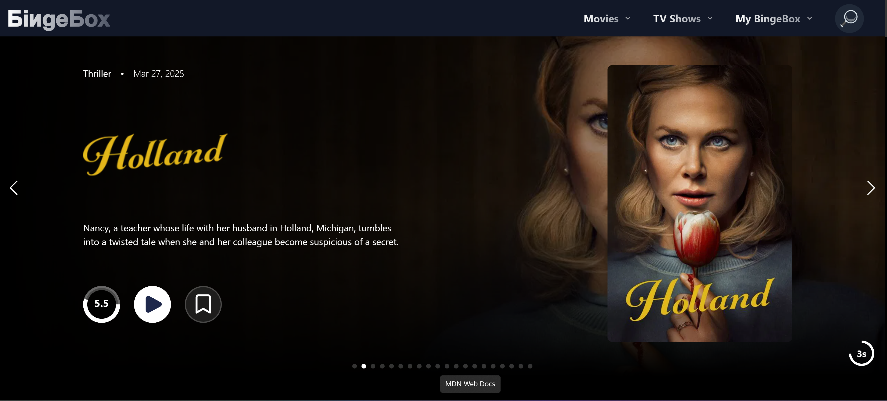
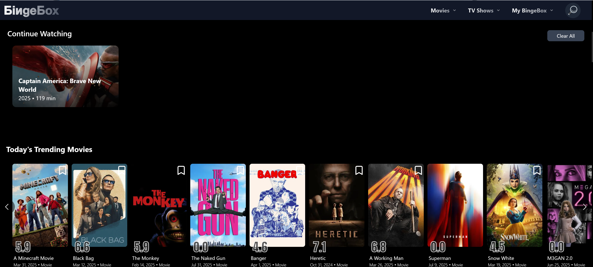
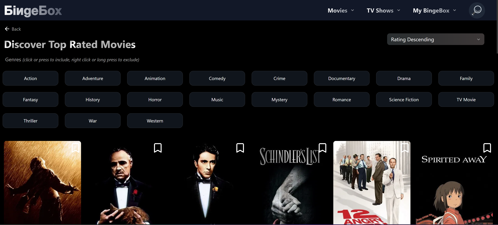
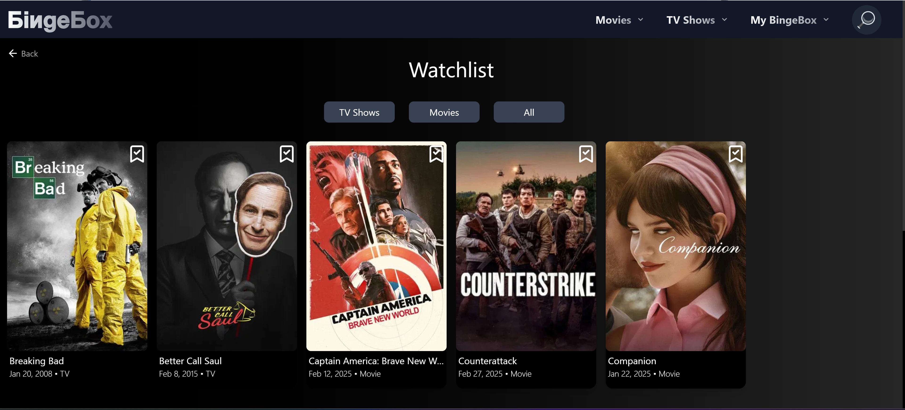
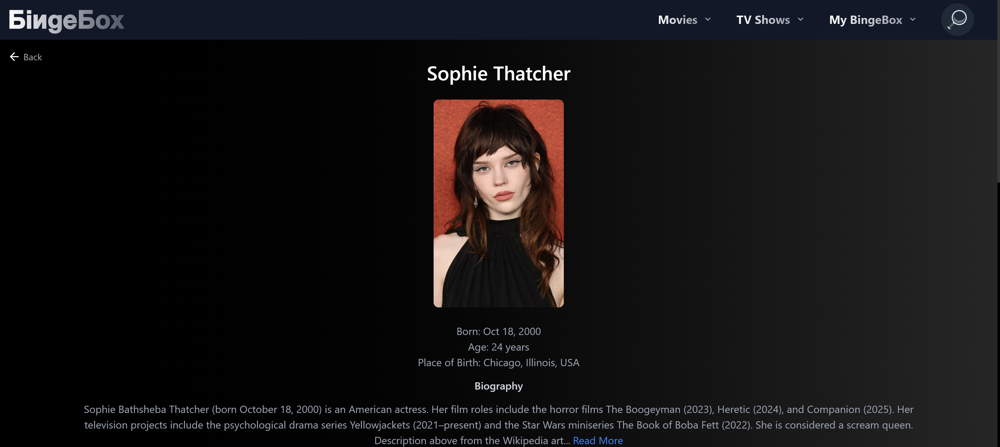
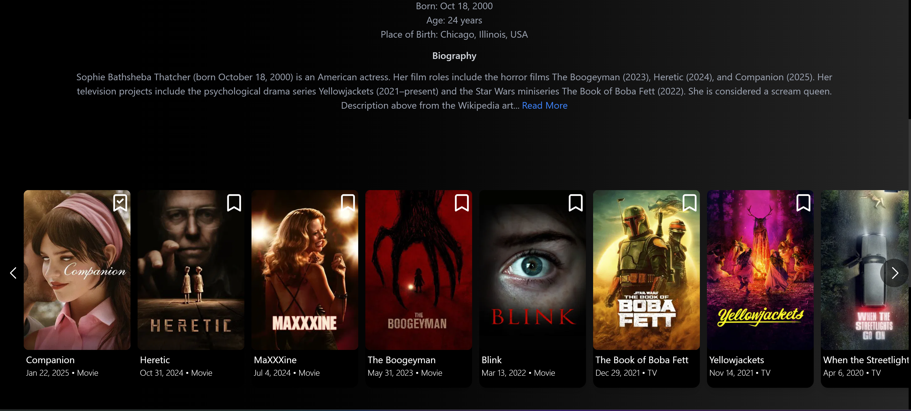

# Movies Unlimited

[](https://app.netlify.com/sites/movies-unlimited/deploys)

        

## Description ✏️

A place to track and watch upcoming and favorite movie & tv shows.

This appication is in-progress. This is the client side.

### Interesting Problems Solved During Building

**Problem:** On page load, for the main page slide show, it is necessary to make 21 api calls due to the information required and the way the TMDB api is set up. This brings me to my first interesting problem with this application. I don't want any performance issues due to this amount of calls.

**Solution:** After weighing pros & cons of various approaches, and keeping React Query's power at the forefront of my thinking, I am making only 3 api calls on page load - the 20 movies, and the title logos for only two movies (the title logos require a separate hit by movie id to an images endpoint, this is where 20 extra fetches come into play). Then, as the slideshow goes on, or as the user hits the next button, I am prefetching the next logo that will be needed while filling up the React Query cache and then relying on the cache from that point forward. Addition of persistance of slide data to local storage with React Query persistance provider and runtime caching of the actual images reduces future page loads even further (exact reduction time to follow)
Initial load 850-1000ms  
 New load time = 400-560ms Roughly 50% improvement.

**Problem:** The addition of three carousel item components below the slideshow increased initial page loading time for three additional api calls.

**Solution:** Created a fetch on demand only when the user scrolls down, as caught by the react intersection observer. This prevents any fetching if the user never scrolls down, but fetches each carousel component at a threshold of 0.0 and a rootMargin of 100px, 0px when the user continues scrolling down on the page.

**Problem:** The addition of more carousel item components on the main page to feature shows from Netflix or movies from Hulu, for example, was causing a increasing drag on the back button responsiveness to get back to that page from the item detail page. The user is encouraged to click on a card to find out more about a show or a movie on a detail page, and the detail page is preloaded on hover with that intent, however when the user hits the back button to resume looking at more items back navigation was experiencing delays of up to 275ms. This was noticeable and ultimately discouraging use of the detail page.

**Solution:**: An educated guess was that the delay came from React unmounting and remounting the slide and all the carousel components on every navigation and back navigation respectively. KeepAlive from react-activation was employed to stop the unmounting of the page and indeed, back button response is now instant - in line with user expectations. A state hook in App.js was removed and refactored to use zustand due to a warning about the hook and timing of mounting. StrictMode in dev mode will throw a warning about state continuously, but that is not a problem in production or if StrictMode is removed in dev.

**Problem:** Image loading is janky if internet speeds are down or general resources are compromised (processing, memory). Images attempt to load immediately by default but paint in blurry, ugly pieces instead of the entire image coming in nicely all at once.

**Solution:** Preloading of important images and progressive loading of images. Placeholder -> lowres -> hiRes. Hold the image for paint until it is ready. transition-opacity makes the image appearance look controlled and smooth.

**Problem:** This application is a PWA and uses a service worker to detect when new version of the app is available and then prompts the user to reload if they are ready. Unfortunately, the old SW was being held on to by browser memory, so each time the user reloaded, the memory usage was increasing and not falling back to baseline after a few minutes. Closing the tab and reopening got memory back down but this was not considered acceptable.

**Solution:**  Adding an explict unregister command in the helper component calling registerSW and generating the prompt helped the browser to let go of the old service worker quickly without needing the tab closed and allowed memory to go back to baseline after reload. Caches were removed by vite and memory was back to normal in just a few minutes. 

**Problem:** Bookmarks were originally stored as an array and a 'some' function was used to see if any particular item was in the bookmarks array. This could lead to a performance bottleneck as bookmarks array grows and the 'some' function was breaking memoization in the map of MemoizedItemCards due to new function creation on every render.

**Solution:** Refactored bookmarks to an object using id-media_type as key. Checking if a movie or tv show is in the bookmarks object is O(1) time, a new function is not created on every render and React can properly maintain memoization. A significant drop in memory use was noted.

### Metrics as of 4/7/2025

- ~280 MB average browser memory usage after good amount of app usage with heavy caching strategies- holds steady for hours.
- ~42-72MB heap size depending on how much is cached by react query (depends on usage)
- 99% performance by Lighthouse
- 0.0 CLS
- 225kb compressed size after build
- All paint metrics in the green, including INP with page navigation

## Table of Contents 📖

[Installation](#installation)

[Usage](#usage)

[Issues](#known-issues)

[Contributing](#how-to-contribute)

[Tests](#tests)

[Credits](#credits)

[Questions](#questions)

## Installation

To install necessary dependencies, run the following command:

```
npm i
```

## Usage

Clone the repository, run the install command and then 'npm run dev'. Then navigate to the localhost port, 3003.

You can also build with 'npm run build' and then run in production mode with 'npm run preview'

You will need a TMDB api key in an env.

### Deployed Link

Temporary staging deploy link: https://movies-unlimited.netlify.app/ <br/>
Final deploy link TBD.

### Screenshots
















---

## Known Issues

TBD

## How To Contribute

Fork the repository and make a pull request with your new code.

## Tests

To run tests, run the following command:

## Credits

TMDB API

## Questions

If you have any questions about the repo or notice any bugs you want to report, open an issue or contact me directly at megan.meyers.388@gmail.com.
